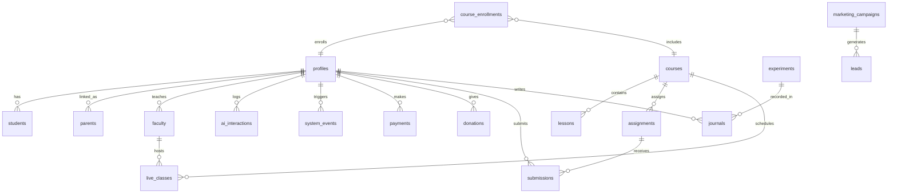

# Database Schema Diagram

Notes
- `profiles` is the canonical user profile table linked to `auth.users`.
- `roles` provides the role catalog; `profiles.role` uses controlled values.
- Realtime is enabled for `live_classes`, `assignments`, `submissions`, `journals`, `payments`, `donations`, `system_events`.
